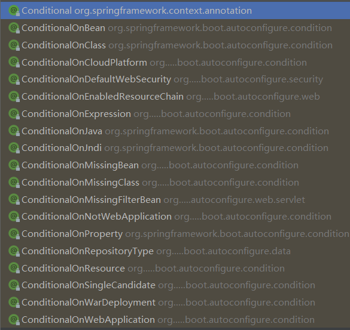

# 基础入门

##  Hello Word

1. 创建maven工程
2. 引入依赖

```xml
    <!--springboot 父项
	它提供了有用的 Maven 默认配置。还提供了依赖管理功能-->
    <parent>
        <groupId>org.springframework.boot</groupId>
        <artifactId>spring-boot-starter-parent</artifactId>
        <version>2.6.1</version>
    </parent>
    
    <!--web模块依赖-->
    <dependencies>
        <dependency>
            <groupId>org.springframework.boot</groupId>
            <artifactId>spring-boot-starter-web</artifactId>
        </dependency>
    </dependencies>
```

3. 创建主程序

```java
/**
 * springboot 主程序
 */
//声明这是一个springboot应用
@SpringBootApplication
public class MyApplication {
    public static void main(String[] args) {
        SpringApplication.run(MyApplication.class, args);
    }
}


```

4. 编写业务

```java
//集成@Controller @ResponseBody
@RestController
public class HelloController {
    @RequestMapping("/hello")
    public String hello(){
        return "hello springboot";
    }
}


```

5. 测试
直接运行主程序的main方法
6. 简化配置

在resource目录下创建application.properties配置文件, 所有springboot配置写在该文件下,例如:
```
server.port=8888
```
属性名查看官方文档Application Properties章. 

7. 简化部署

引入插件:
```xml
    <build>
        <plugins>
            <plugin>
                <groupId>org.springframework.boot</groupId>
                <artifactId>spring-boot-maven-plugin</artifactId>
            </plugin>
        </plugins>
    </build>
```
该插件直接把程序打包成可执行jar包


## 依赖管理

* Spring Boot Stater 可以理解为这是一个启动器，这个启动器会自动依赖其他组件，一站式获取你需要的与spring有关的组件。
* 引入依赖无需关心版本号, 自动版本仲裁
* 可以在pom.xml中修改版本号, 文件中优先级最高:

```xml
    <properties>
        <mysql.version>版本号</mysql.version>
    </properties>
```

## 自动配置
* 自动配好Tomcat
    * 引入Tomcat依赖
    * 配置Tomcat
* 自动配好SpringMVC
    * 引入SpringMVC全套组件
    * 自动配好SpringMVC常用组件(功能)
* 自动配好Web常见功能，如:字符编码问题
    * SpringBoot帮我们配置好了所有web开发的常见场景
* 默认的包结构
    * 主程序所在包及其下面的所有子包里面的组件都会被默认扫描进来
    * 无需以前的包扫描配置
    * 想要改变扫描路径，@SpringBootApplication(scanBasePackages="com.atguigu");或者@ComponentScan指定扫描路径

* 各种配置拥有默认值
    * 默认配置最终都是映射到MultipartProperties
    * 配置文件的值最终会绑定每个类上，这个类会在容器中创建对象

* 按需加载所有自动配置项
    * 非常多的starter
    * 引入了哪些场景这个场景的自动配置才会开启
    * SpringBoot所有的自动配置功能都在spring-boot-autoconfigure包里面

## 容器

### 1.组件添加

#### 1.1@Configuration/@Bean

```java
/**
 * @Configuration 声明配置类
 * 配置类中使用@Bean注解就是给容器注册组件, 默认为单实例
 * proxyBeanMethods属性: 代理bean的方法
 *     FULL(proxyBeanMethods = true)(默认) 单实例, 每次会进行扫描,如果已存在实例直接返回该对象
 *     LITE(proxyBeanMethods = false)   直接返回新实例
 */
@Configuration(proxyBeanMethods = true)
public class MyConfig1 {
    //给容器添加组件,组件名=方法名, 组件类型=方法返回类型, 组件值=方法返回值
    @Bean
    public Person person1(){
        return new Person(1001,"lqw");
    }
}
```


#### 1.2 @Component/@Controller/@Service/@Repository
原生Spring注册组件方式

#### 1.3 @Import
位置 : 配置类上
作用 : 注册组件, 默认名称为组件类的全类名

```java
@Import(Person.class,...)
```

 #### 1.4 @Conditional
条件装配 : 满足条件则进行组件注入
@Conditional派生注解


#### 1.4 @ImportResource
导入资源 : 原生配置文件引入加载xml配置文件进行组件装配
   位置 : 配置类上

```java
@ImportResource("classpath:*.xml")
```
### 2. 配置绑定
将application.properties中的配置绑定到javabean中
```xml
person.id=1001
person.name=lqw
```
#### 2.1 @ConfigurationProperties
1. 需要springboot配置注解处理器
```xml
        <dependency>
            <groupId>org.springframework.boot</groupId>
            <artifactId>spring-boot-configuration-processor</artifactId>
            <optional>true</optional>
        </dependency>
```
2. 在Bean类上加注解
```java
@Component //注册组件(必须)
@ConfigurationProperties(prefix = "person")//找到配置文件中前缀为person的配置
public class Person {
	//根据bean属性名与配置文件的后缀,一一对应注入属性
    private int id;
    private String name;
}
```

#### 2.2 @EnableConfigurationProperties
在配置类上
```java
/**
* @EnableConfigurationProperties两个共功能: 
*     1. 将Person类注册到容器中  
*     2. 开启Person类的配置绑定
*/
@EnableConfigurationProperties(Person.class)
```

## 开发技巧

###  Lombok(不建议)
优点: 简化开发, 通过注解自动为bean类生成getter/setter/构造/toString方法
缺点: 属于第三方库, 可能出现版本不兼容问题, 降低代码可读性

1. 引入依赖
```xml
        <dependency>
            <groupId>org.projectlombok</groupId>
            <artifactId>lombok</artifactId>
        </dependency>
```
2. 安装插件
IDEA内置插件安装

3. 使用注解代替模板方法
```java

@Getter//生成Getter方法,用在属性上生成单个, 用在类上生成全部
@Setter//生成Setter方法
@AllArgsConstructor//生成全参构造
@NoArgsConstructor//生成无参构造
@EqualsAndHashCode//生成Equals()/HashCode()
@ToString//生成ToString()
@Data // @Data 是 @Getter、 @Setter、 @ToString、 @EqualsAndHashCode 和 @RequiredArgsConstructor 的快捷方式。
public class Example{
	private int e1;
	private int e2;
	//属性...
}
```

### dev-tools

伪热更新, 实质是自动重启, 当代码发生改变按Ctrl+F9, 自动编译重启项目;
依赖:
```xml
        <dependency>
            <groupId>org.springframework.boot</groupId>
            <artifactId>spring-boot-devtools</artifactId>
            <optional>true</optional>
        </dependency>
```

### Spring Initailizr

spring初始化向导, 简化创建springboot项目流程, 可以通过IDAE直接使用Spring Initailizr. 

# 核心功能

## 配置文件

### 1. properties

### 2. yaml
YAML 是一种标记语言, 非常适合用来做以数据为中心的配置文件

#### 基本语法
基本语法
* key: value; kv之间有空格
* 大小写敏感
* 使用缩进表示层级关系
* 缩进不允许使用tab，只允许空格
* 缩进的空格数不重要，只要相同层级的元素左对齐即可
* ''#'表示注释
* ''与""表示字符串内容 会被 不转义/转义

#### 数据类型
* 字面量: 单个的、不可分割的值
```yaml
k: v
```

* 对象:键值对的集合
```yaml
#行内写法 
k: [v1,v2,v3]
#或者
k:
    k1: v1
    k2: v2
    k3: v3
```

* 数组
```xml
#行内写法
k: [v1,v2,v3]
#或者
k:
    - v1
    - v2
    - v3
```

#### 配置注解处理器
```xml
        <dependency>
            <groupId>org.springframework.boot</groupId>
            <artifactId>spring-boot-configuration-processor</artifactId>
            <optional>true</optional>
        </dependency>
```

## WEB开发
### 1. 简单功能
#### 静态资源访问
只要静态资源放在: /static (or /public or /resources or /META-INF/resources)下, 可以直接通过/工程根目录/静态资源名访问
原理: 静态映射/**

* 改变静态资源访问前缀
```yaml
spring:
  mvc:
    static-path-pattern: /static/**
```

* 改变默认静态资源路径
```yaml
spring:
  web:
    resources:
      static-locations: /static-new/
```

* 禁止静态资源访问

```yaml
spring:
  web:
    resources:
      #关闭静态自远方访问
      add-mappings: false
```


* webjar
  访问jar包

#### 欢迎页
1. 静态资源路径下 index.html 默认为欢迎页
2. 如果资源路径下找不到 index.html, 则回去RequestMapping中找一个index作为欢迎页

### 2. 请求参数处理 
#### rest风格支持
```yaml

spring:
  mvc:
    # restul风格, 开启HiddenHttpMethodFilter,支持表单delete/put/patch请求
    hiddenmethod:
      filter:
        enabled: true
```

#### 请求映射原理
所有的请求映射都在HandlerMapping中。
* SpringBoot自动配置欢迎页的WelcomePageHandlerMapping。访问/能访问到index.html;
* SpringBoot自动配置了默认的RequestMappingHandlerMapping

请求进来，挨个尝试所有的HandlerMapping看是否有请求信息。
* 如果有就找到这个请求对应的handler
*  如果没有就查找下一个 HandlerMapping
* 我们需要一些自定义的映射处理，我们也可以自己给容器中放HandlerMapping。自定义HandlerMapping

#### 常用参数注解
* @PathVariable（路径变量）
* @RequestHeader(获取请求头)
* @RequestParam(获取请求参数)
* @CookieValue（获取cookie值）
* @RequestAttribute (获取request域属性)
* @RequestBody（获取请求体）
* @MatrixVariable（矩阵变量）


矩阵变量@MatrixVariable:  在路径变量中传数据,以分号为分隔符, 格式: 
```url
locolhost:8080/user;age=1
```

有些springboot版本默认关闭矩阵变量需要手动打开;
```java
    @Bean
    public WebMvcConfigurer webMvcConfigurer() {
        return new WebMvcConfigurer() {
            @Override
            public void configurePathMatch(PathMatchConfigurer configurer) {
                UrlPathHelper urlPathHelper = new UrlPathHelper();
                // 不移除；后面的内容。矩阵变量功能就可以生效
                urlPathHelper.setRemovesemicolonContent(false);
                configurer.setUrlPathHelper(urlPathHelper);
            };
        };
    }
```

* 解决矩阵变量中同名问题
```java
    @RequestMapping("/{bossid}/{empid}")
    //矩阵变量一定要在路径变量中使用
    //pathVar 指定在哪个路径变量中的age
    public String test(@MatrixVariable(value = "age",pathVar = "bossid")String age1,
                       @MatrixVariable(value = "age",pathVar = "empid")String age2){
        System.out.println(age1);
        return age1+" "+age2;
    }
```

#### Servlet Api 参数
WebRequest、ServletRequest、MultipartRequest、HttpSession、javax.servlet.http.PushBuilder、Principal、InputStream、Reader、HttpMethod、Locale、TimeZone、Zone
参数解析器: ServletRequestMethodArgumentResolver

#### 复杂参数
Map、Model(map、model里面的数据会放在request的请区域, 相当于request.setAttribute)、Errors/BindingResult、Model、RedirectAttributes(重定向携带数据)、ServletResponse、SessionStatus、UriComponentsBuilder、ServletUriComponentsBuilder

#### 自定义对象参数

#### 自定义Converter

定义:
```java
@Bean
    public WebMvcConfigurer webMvcConfigurer(){
        return new WebMvcConfigurer() {
           //自定义Converter 定义字符串转为pojo对象的规则
            @Override
            public void addFormatters(FormatterRegistry registry) {
                registry.addConverter(new Converter<String, Person>() {
                    @Override
                    public Person convert(String source) {
                        if(!StringUtils.isEmpty(source)){
                            Person person=new Person();
                            String[] info=source.split(",");
                            person.setId(Integer.parseInt(info[0]));
                            person.setName(info[1]);
                            return person;
                        }
                        return null;
                    }
                });
                //WebMvcConfigurer.super.addFormatters(registry);
            }
        };
    }
```

### 3. 数据响应与内容协商

#### 返回json数据
1. 引入`spring-boot-starter-web`
2. 在控制器方法上使用ResponseBody注解
3. HTTPMassageConverter 将pojo对象转换成json数据

底层原理:
1. 返回值处理器判断是否支持这种类型返回值 supportsReturnType
2. 返回值处理器调用 handleReturnValue 进行处理
3. RequestResponseBodyMethodProcessor 可以处理返回值标了@ResponseBody 注解的。
    1. 利用 MessageConverters 进行处理 将数据写为json
        1. 内容协商（浏览器默认会以请求头的方式告诉服务器他能接受什么样的内容类型）
        2. 服务器最终根据自己自身的能力，决定服务器能生产出什么样内容类型的数据，
        3. SpringMVC会挨个遍历所有容器底层的 HttpMessageConverter，看谁能处理？
            1. 得到MappingJackson2HttpMessageConverter可以将对象写为json
            2. 利用MappingJackson2HttpMessageConverter将对象转为json再写出去。


* SpringMVC支持的返回值类型  
ModelAndView
Model
View
ResponseEntity
ResponseBodyEmitter
StreamingResponseBody
HttpEntity
HttpHeaders
Callable
DeferredResult
ListenableFuture
Comp
letionStage
WebAsyncTask
有 @ModelAttribute
有 @ResponseBody

#### 内容协商
根据客户端接收能力不同, 返回不同媒体类型的数据. 
##### xml支持
 1. 引入xml依赖
```xml
        <dependency>
            <groupId>com.fasterxml.jackson.dataformat</groupId>
            <artifactId>jackson-dataformat-xml</artifactId>
        </dependency>
```
2. 客户端设置可接收的返回值类型

##### 内容协商原理:

1. 判断当前响应头中是否已经有确定的媒体类型。MediaType
2. 获取客户端(PostMan、浏览器）支持接收的内容类型。(获取客户端Accepte请求头字段)[application/xml]
3. 遍历循环所有当前系统的MessageConveer，看谁支持操作这个对象（Person)
4. 找到支持操作Person的converter，把converter支持的媒体类型统计出来。
5. 客户端需要【application/xml】。服务端能力【10种、json、xml】
6. 进行内容协商的最佳匹配媒体类型
7. 用支持将对象转为最佳匹配媒体类型的converter。调用它进行转化。

##### 开启浏览器参数方式内容协商功能

即自定义浏览器接收数据格式

```xml
spring:
  mvc:
    contentnegotiation:
      favor-parameter: true
```
使用方式:url + fomat=数据格式
```url
http://localhost:8080/person?format=json
```

##### 自定义MassageConverter
实现多协议数据兼容。json、xml、x-guigu
0、@ResponseBody 响应数据出去 调用 RequestResponseBodyMethodProcessor 处理
1、Processor 处理方法返回值。通过MessageConverter处理
2、所有MessageConverter合起来可以支持各种媒体类型数据的操作（读、写）
3、内容协商找到最终的 messageConverter;

自定义步骤:
1. 编写MyMassageConverter实现HttpMassageConverter
2. 定制化SpringMVC功能: 添加MyMassageConverter到converters

```java
            @Override
            public void extendMessageConverters(List<HttpMessageConverter<?>> converters) {
                converters.add(new MyMassageConverter());
            }
```

3. 定制化 浏览器参数方式内容协商功能 
添加自定义format
```java
@Override
            public void configureContentNegotiation(ContentNegotiationConfigurer configurer) {
                //WebMvcConfigurer.super.configureContentNegotiation(configurer);
            }
```

### 4. 拦截器

1. 编写拦截器实现HandlerInterceptor接口
2. 拦截器注册得到容器中,实现WebMvcConfigurer的addInterceptors
   1. 指定拦截规则


### 5. 异常处理

1. 默认异常处理
SpringBoot 默认的处理异常的机制：SpringBoot 默认的已经提供了一套处理异常的机制。一旦程序中出现了异常 SpringBoot 会像/error 的 url 发送请求。在 springBoot 中提供了一个叫 BasicExceptionController 来处理/error 请求，然后跳转到默认显示异常的页面来展示异常信息。
前后端分离,  后端不再编写负责页面跳转的逻辑,  只需要通过/error返回错误pojo的json数据即可. 

2. 自定义异常处理: @ExceptionHandler 注解处理异常
在控制器中编写:
```java
/**
     * java.lang.ArithmeticException
     * 该方法需要返回一个 ModelAndView：目的是可以让我们封装异常信息以及视图的指定
     * 参数 Exception e:会将产生异常对象注入到方法中
     */
    @ExceptionHandler(value={java.lang.ArithmeticException.class})
    public ModelAndView arithmeticExceptionHandler(Exception e){
        ModelAndView mv = new ModelAndView();
        mv.addObject("error", e.toString());
        //无视图解析器, 所以要写页面全称
        mv.setViewName("error1.html");
        return mv;
    }
```
提示
>BasicErrorController 可以作为自定义 ErrorController 的基类，这非常有用，尤其是在您想添加一个新的内容类型（默认专门处理 text/html，并为其他内容提供后备）处理器的情况下。要做到这点，您只需要继承 BasicErrorController 并添加一个带有 produces 属性的 @RequestMapping 注解的公共方法，之后创建一个新类型的 bean。

定义一个带有 @ControllerAdvice 注解的类来自定义为特定控制器或异常类型返回的 JSON 文档：
```java
@ControllerAdvice(basePackageClasses = AcmeController.class)
public class AcmeControllerAdvice extends ResponseEntityExceptionHandler {

    @ExceptionHandler(YourException.class)
    @ResponseBody
    ResponseEntity<?> handleControllerException(HttpServletRequest request, Throwable ex) {
        HttpStatus status = getStatus(request);
        return new ResponseEntity<>(new CustomErrorType(status.value(), ex.getMessage()), status);
    }

    private HttpStatus getStatus(HttpServletRequest request) {
        Integer statusCode = (Integer) request.getAttribute("javax.servlet.error.status_code");
        if (statusCode == null) {
            return HttpStatus.INTERNAL_SERVER_ERROR;
        }
        return HttpStatus.valueOf(statusCode);
    }

}
```
如果同包下定义的控制器 AcmeController 抛出了 YourException，则将使用 CustomerErrorType 类型的 POJO 来代替 ErrorAttributes 做 JSON 呈现。

#### 基于前后端纹分离的异常处理

1. 定义返回值结构信息
一个比较常用的数据格式，统一所有服务的返回值格式。
```java
public class ResultMsg<T> {
    private boolean result; //服务请求 是否成功
    private int code; //服务器处理结果编码
    private String message; //编码对应的文本信息
    private T data; // 返回的POJO实体
    //getter setter
}

```

2. 定义对应的消息码和消息
```java
public enum ResultCode {
    SUCCESS(1000, "SUCCESS"),
    METHODFAIL(2000, "ENCOUNTER AN ERROR WHEN EXECUTE METHOD"),
    UNKNOWEXCEPTION(3000, "THIS IS AN UNKNOW EXCEPTION");

    private int code;
    private String msg;

    ResultCode(int code, String msg){
        this.code = code;
        this.msg = msg;
    }
    //getter setter
}
```

3. 自定义异常继承RuntimeException
```java
public class MyException extends RuntimeException{
    private ResultMsg exception;

    public MyException(ResultMsg exception){
        this.exception = exception;
    }

    public ResultMsg getException() {
        return exception;
    }

    public void setException(ResultMsg exception) {
        this.exception = exception;
    }
}
```

4. @RestControllerAdvice 统一异常处理
@RestControllerAdvice都是对Controller进行增强的，可以全局捕获spring mvc抛的异常。RestControllerAdvice = ControllerAdvice + ResponseBody
@ExceptionHandler(value = Exception.class) ExceptionHandler的作用是用来捕获指定的异常。
```java
@RestControllerAdvice(annotations = RestController.class)
public class ErrorController{
    @ExceptionHandler(java.lang.ArithmeticException.class)
    public ResultMsg getAriError(){
        return new ResultMsg(false, ResultCode.ARITHMETICEXCEPTION,null);
    }
}
```

### 6. 文件上传和下载

#### 上传
1. 开启文件上传
```yaml
  servlet:
    multipart:
      enabled: true # 开启文件上传
      max-file-size: 100KB #
      max-request-size: 200MB #请求阈值
      location: D:\ASP.NET\SpringBoot\ #设置文件绝对路径
```
2. 控制器方法
```java
    @RequestMapping("/upfile")
    public ResultMsg<String> upLoad(@RequestParam("file") MultipartFile file) throws IOException{
        if (file != null) {
            String fileName = file.getOriginalFilename();
            String code = UUID.randomUUID().toString().replaceAll("-", "");
            assert fileName != null;
            String newFileName = code + fileName.substring(fileName.lastIndexOf('.'));
            //String currentDateFolder = DateFormatUtils.format(new Date(), "yyyyMMdd");
            //如果使用相对路径,则文件上传地址为location + 这里的相对路径  
            String destFilePath = "src/main/resources/image" + File.separator + newFileName;
            System.out.println(destFilePath);
            File destFile = new File(destFilePath);
            if (!destFile.getParentFile().isDirectory()) {
                destFile.getParentFile().mkdirs();
            }
            file.transferTo(destFile);
            return new ResultMsg<>(true, ResultCode.SUCCESS,"文件上传成功");
        }
        return new ResultMsg<>(true, ResultCode.FAILED,"空文件");
    }
```

#### 下载

```java
 @RequestMapping("/downfile")
    public ResponseEntity<byte[]> testDown()throws IOException {
        String realpath="D:\\ASP.NET\\SpringBoot\\src\\main\\resources\\image\\美女.jpg";
        //创建输入流
        InputStream is=new FileInputStream(realpath);
        //创建字节数组
        //available() 获取输入流长度
        byte[] bytes=new byte[is.available()];
        //将字节流读到字节数组中
        is.read(bytes);
        //创建HttpHeaders对象设置响应头信息
        MultiValueMap<String,String> headers=new HttpHeaders();
        //设置下载方式和下载文件名
        headers.add("Content-Disposition","attachment;filename=美女.jpg");
        //设置响应头状态码
        HttpStatus status=HttpStatus.OK;
        //创建ResponseEntity对象
        ResponseEntity<byte[]> response=new ResponseEntity<>(bytes,headers,status);
        is.close();
        return response;
    }
```

### 7. Web原生组件注入 Filter/Servlet/Listener
1. 使用Servlet API
	1. 在主配置类上使用`@ServletComponentScan(basePackages=包名)`开启组件组件扫描
	2. 使用`@WebServlet` `@WebListener` `@WebFilter` 标注组件
2. 在配置类中使用@Bean注册组件
```java
//LITE模式: 保证组件单实例
@Configuration(proxyBeanMethods = true)
public class MyServletConfig {
    @Bean
    public MyInterceptor myInterceptor(){
        return new MyInterceptor();
    }
}
```

```java
//使用RegistrationBean注册组件
    @Bean
    public ServletRegistrationBean statViewServlet(){
        StatViewServlet statViewServlet = new StatViewServlet();
        ServletRegistrationBean<StatViewServlet> registrationBean =
                new ServletRegistrationBean<>(statViewServlet, "/druid/*");

        //监控页账号密码：
        registrationBean.addInitParameter("loginUsername","admin");
        registrationBean.addInitParameter("loginPassword","123456");

        return registrationBean;
    }
```


### 补充: Filter和Interceptor

#### Filter
Filter可以认为是Servlet的一种“加强版”，对用户请求进行预处理，也可以对HttpServletResponse进行后处理，是个典型的处理链。Filter也可以对用户请求生成响应，这一点与Servlet相同，但实际上很少会使用Filter向用户请求生成响应。使用Filter完整的流程是：Filter对用户请求进行预处理，接着将请求交给Servlet进行预处理并生成响应，最后Filter再对服务器响应进行后处理。

Filter有如下几个用处。
在HttpServletRequest到达Servlet之前，拦截客户的HttpServletRequest。
根据需要检查HttpServletRequest，也可以修改HttpServletRequest头和数据。
在HttpServletResponse到达客户端之前，拦截HttpServletResponse。
根据需要检查HttpServletResponse，也可以修改HttpServletResponse头和数据。

Filter有如下几个种类。
用户授权的Filter：Filter负责检查用户请求，根据请求过滤用户非法请求。
日志Filter：详细记录某些特殊的用户请求。
负责解码的Filter:包括对非标准编码的请求解码。
能改变XML内容的XSLT Filter等。
Filter可以负责拦截多个请求或响应；一个请求或响应也可以被多个Filter拦截。

创建一个Filter只需两个步骤
创建Filter处理类
web.xml文件中配置Filter
创建Filter必须实现javax.servlet.Filter接口，在该接口中定义了如下三个方法。

void init(FilterConfig config):用于完成Filter的初始化。
void destory():用于Filter销毁前，完成某些资源的回收。
void doFilter(ServletRequest request,ServletResponse response,FilterChain chain):实现过滤功能，该方法就是对每个请求及响应增加的额外处理。该方法可以实现对用户请求进行预处理(ServletRequest request)，也可实现对服务器响应进行后处理(ServletResponse response)—它们的分界线为是否调用了chain.doFilter(),执行该方法之前，即对用户请求进行预处理；执行该方法之后，即对服务器响应进行后处理。


#### Interceptor
拦截器，在AOP(Aspect-Oriented Programming)中用于在某个方法或字段被访问之前，进行拦截，然后在之前或之后加入某些操作。拦截是AOP的一种实现策略。

在WebWork的中文文档的解释为—拦截器是动态拦截Action调用的对象。它提供了一种机制可以使开发者可以定义在一个Action执行的前后执行的代码，也可以在一个Action执行前阻止其执行。同时也提供了一种可以提取Action中可重用的部分的方式。

拦截器将Action共用的行为独立出来，在Action执行前后执行。这也就是我们所说的AOP，它是分散关注的编程方法，它将通用需求功能从不相关类之中分离出来；同时，能够共享一个行为，一旦行为发生变化，不必修改很多类，只要修改这个行为就可以。

拦截器将很多功能从我们的Action中独立出来，大量减少了我们Action的代码，独立出来的行为就有很好的重用性。

当你提交对Action(默认是.action结尾的url)的请求时，ServletDispatcher会根据你的请求，去调度并执行相应的Action。在Action执行之前，调用被Interceptor截取，Interceptor在Action执行前后执行。

创建Interceptor必须实现com.opensymphony.xwork2.interceptor.Interceptor接口，该接口定义了如下三个方法。

void init():在该拦截器被实例化之后，在该拦截器执行拦截之前，系统将回调该方法。对于每个拦截器而言，其init()方法只执行一次。因此，该方法的方法体主要用于初始化资源。
void destory():该方法与init()方法对应。在拦截器实例被销毁之前，系统将回调该拦截器的destory方法，该方法用于销毁在init方法里打开的资源。
String intercept(ActionInvocation invocation):该方法是用户需要实现的拦截动作。就像Action的execute方法一样。intercept方法会返回一个字符串作为逻辑视图。如果该方法直接返回了一个字符串，系统会将跳转到该逻辑视图对应的实际视图资源，不会调用被拦截的Action。该方法的ActionInvocation参数包含了被拦截的Action的引用，可以通过调用该参数的invoke方法，将控制权转给下一个拦截器，或者转给Action的execute方法(如果该拦截器后没有其他拦截器，则直接执行Action的execute方法)。


>Filter和Interceptor的区别
>> Filter是基于函数回调的，而Interceptor则是基于Java反射的。
>> Filter依赖于Servlet容器，而Interceptor不依赖于Servlet容器。
>> Filter对几乎所有的请求起作用，而Interceptor只能对action请求起作用。
>> Interceptor可以访问Action的上下文，值栈里的对象，而Filter不能。
>> 在action的生命周期里，Interceptor可以被多次调用，而Filter只能在容器初始化时调用一次。
     > Filter和Interceptor的执行顺序
     > 过滤前-拦截前-action执行-拦截后-过滤后


过滤器和拦截器非常相似，但是它们有很大的区别
最简单明了的区别就是过滤器可以修改request，而拦截器不能
过滤器需要在servlet容器中实现，拦截器可以适用于javaEE，javaSE等各种环境
拦截器可以调用IOC容器中的各种依赖，而过滤器不能
过滤器只能在请求的前后使用，而拦截器可以详细到每个方法

总的来说
过滤器就是筛选出你要的东西，比如requeset中你要的那部分
拦截器在做安全方面用的比较多，比如终止一些流程

过滤器（Filter）         ：可以拿到原始的http请求，但是拿不到你请求的控制器和请求控制器中的方法的信息。
拦截器（Interceptor）：可以拿到你请求的控制器和方法，却拿不到请求方法的参数。
切片   （Aspect）       :  可以拿到方法的参数，但是却拿不到http请求和响应的对象

## 数据访问

#### 1. 数据源自动配置

1. 引入starter
```xml
        <dependency>
            <groupId>org.springframework.boot</groupId>
            <artifactId>spring-boot-starter-data-jdbc</artifactId>
        </dependency>
```

2. 引入数据库驱动
```
        <dependency>
            <groupId>mysql</groupId>
            <artifactId>mysql-connector-java</artifactId>
        </dependency>
```

3. 配置数据源和jdbcTemplate
```yaml
spring:
  datasource:
    url: jdbc:mysql://localhost:3306/jdbctest
    username: root
    password: 123456
    driver-class-name: com.mysql.jdbc.Driver
  jdbc:
    template:
      query-timeout: 3
```

#### 2. 自定义数据源
以Druid为例

##### 方式一 手动

1. 引入依赖
```xml
        <!--德鲁伊数据源-->
        <dependency>
            <groupId>com.alibaba</groupId>
            <artifactId>druid</artifactId>
            <version>1.2.8</version>
        </dependency>
```

2. 配置数据源

```java
@Configuration
public class MyConfig {

    @Bean
    @ConfigurationProperties("spring.datasource")//复用配置文件的数据源配置
    public DataSource dataSource() throws SQLException {
        DruidDataSource druidDataSource = new DruidDataSource();
//所有set属性都可以在配置文件中写
//        druidDataSource.setUrl();
//        druidDataSource.setUsername();
//        druidDataSource.setPassword();

        return druidDataSource;
    }
}
```

##### 方式二 使用stater

1. 引入stater

```xml
<dependency>
    <groupId>com.alibaba</groupId>
    <artifactId>druid-spring-boot-starter</artifactId>
    <version>1.1.17</version>
</dependency>
```

2. 配置

```yaml
spring:
  datasource:
    url: jdbc:mysql://localhost:3306/db_account
    username: root
    password: 123456
    driver-class-name: com.mysql.jdbc.Driver

    druid:
      aop-patterns: com.atguigu.admin.*  #监控SpringBean
      filters: stat,wall     # 底层开启功能，stat（sql监控），wall（防火墙）

      stat-view-servlet:   # 配置监控页功能
        enabled: true
        login-username: admin
        login-password: admin
        resetEnable: false

      web-stat-filter:  # 监控web
        enabled: true
        urlPattern: /*
        exclusions: '*.js,*.gif,*.jpg,*.png,*.css,*.ico,/druid/*'


      filter:
        stat:    # 对上面filters里面的stat的详细配置
          slow-sql-millis: 1000
          logSlowSql: true
          enabled: true
        wall:
          enabled: true
          config:
            drop-table-allow: false
```

#### 3. 整合Mybatis

1. 引入stater

```xml
<dependency>
    <groupId>org.mybatis.spring.boot</groupId>
    <artifactId>mybatis-spring-boot-starter</artifactId>
    <version>2.1.4</version>
</dependency>
```

2.  配置
```yaml
mybatis:
  config-location: classpath:mybatis/mybatis-config.xml  #全局配置文件位置
  mapper-locations: classpath:mybatis/*.xml  #sql映射文件位置
  # 可以不要主配置文件 所有属性均可在配置文件中配置
```

3. 自动配置
配置模式:
全局配置文件
SqlSessionFactory：自动配置好了
SqlSession：自动配置了SqlSessionTemplate 组合了SqlSession
@Import(AutoConfiguredMapperScannerRegistrar.class)
Mapper： 只要我们写的操作MyBatis的接口标准了@Mapper就会被自动扫描进来


4. 实现功能

```java
//混合写法
//简单逻辑直接用注解
//复杂逻辑写到mapper
@Mapper
public interface UserMapper {
    public User getUser(Integer id);

    @Select("select * from user where id=#{id}")
    public User getUser2(Integer id);

    public void saveUser(User user);

    @Insert("insert into user(`name`) values(#{name})")
    @Options(useGeneratedKeys = true, keyProperty = "id")
    public void saveUser2(User user);

}
```

## 单元测试

### 引入依赖
```xml
        <dependency>
            <groupId>org.springframework.boot</groupId>
            <artifactId>spring-boot-starter-test</artifactId>
        </dependency>
```
### 常用注解
* @Test :表示方法是测试方法。但是与JUnit4的@Test不同，他的职责非常单一不能声明任何属性，拓展的测试将会由Jupiter提供额外测试
* @ParameterizedTest :表示方法是参数化测试，下方会有详细介绍
*  @RepeatedTest :表示方法可重复执行，下方会有详细介绍
*  @DisplayName :为测试类或者测试方法设置展示名称
* @BeforeEach :表示在每个单元测试之前执行
* @AfterEach :表示在每个单元测试之后执行
* @BeforeAll :表示在所有单元测试之前执行
*  @AfterAII :表示在所有单元测试之后执行
* @Tag:表示单元测试类别，类似于JUnit4中的@Categories
* @Disabled :表示测试类或测试方法不执行，类似于JUnit4中的@Ignore
* @Timeout :表示测试方法运行如果超过了指定时间将会返回错误
* @ExtendWith :为测试类或测试方法提供扩展类引用

### 断言Assertion
#### 简单断言
* assertEquals	判断两个对象或两个原始类型是否相等
* assertNotEquals	判断两个对象或两个原始类型是否不相等
* assertSame	判断两个对象引用是否指向同一个对象
* assertNotSame	判断两个对象引用是否指向不同的对象
* assertTrue	判断给定的布尔值是否为 true
* assertFalse	判断给定的布尔值是否为 false
* assertNull	判断给定的对象引用是否为 null
* assertNotNull	判断给定的对象引用是否不为 null

#### 复合断言
* 数组断言 通过 assertArrayEquals 方法来判断两个对象或原始类型的数组是否相等。
* 组合断言 assertAll()方法接受多个 org.junit.jupiter.api.Executable 函数式接口的实例作为要验证的断言，可以通过 lambda 表达式很容易的提供这些断言。
* 异常断言 在JUnit4时期，想要测试方法的异常情况时，需要用@Rule注解的ExpectedException变量还是比较麻烦的。而JUnit5提供了一种新的断言方式Assertions.assertThrows()，配合函数式编程就可以进行使用。
* 超时断言
JUnit5还提供了Assertions.assertTimeout()为测试方法设置了超时时间。
* 快速失败 通过 fail 方法直接使得测试失败。


### 前置条件
Unit 5 中的前置条件（assumptions【假设】）类似于断言，不同之处在于不满足的断言assertions会使得测试方法失败，而不满足的前置条件只会使得测试方法的执行终止。
前置条件可以看成是测试方法执行的前提，当该前提不满足时，就没有继续执行的必要。

* assumeTrue 和 assumFalse 确保给定的条件为 true 或 false，不满足条件会使得测试执行终止。
* assumingThat 的参数是表示条件的布尔值和对应的 Executable 接口的实现对象。只有条件满足时，Executable 对象才会被执行；当条件不满足时，测试执行并不会终止。

### 嵌套测试
JUnit 5 可以通过 Java 中的内部类和@Nested 注解实现嵌套测试，从而可以更好的把相关的测试方法组织在一起。在内部类中可以使用@BeforeEach 和@AfterEach注解，而且嵌套的层次没有限制。
内层测试可以驱动外层测试, 外层测试不能驱动内层. 

### 参数化测试
`@ParameterizedTest`声明一个参数化测试方法

参数类型
* @ValueSource: 为参数化测试指定入参来源，支持八大基础类以及String类型,Class类型
* @NullSource: 表示为参数化测试提供一个null的入参
* @EnumSource: 表示为参数化测试提供一个枚举入参
* @CsvFileSource：表示读取指定CSV文件内容作为参数化测试入参
* @MethodSource：表示读取指定方法的返回值作为参数化测试入参(注意方法返回需要是一个流)

### Junit4-Junit5迁移
在进行迁移的时候需要注意如下的变化：

* 注解在 org.junit.jupiter.api 包中
* 断言在 org.junit.jupiter.api.Assertions 类中
* 前置条件在 org.junit.jupiter.api.Assumptions 类中。
* 把@Before 和@After 替换成@BeforeEach 和@AfterEach。
* 把@BeforeClass 和@AfterClass 替换成@BeforeAll 和@AfterAll。
* 把@Ignore 替换成@Disabled。
* 把@Category 替换成@Tag。
* 把@RunWith、@Rule 和@ClassRule 替换成@ExtendWith。

## 指标监控Actuator
### 依赖
```xml
<dependencies>
    <dependency>
        <groupId>org.springframework.boot</groupId>
        <artifactId>spring-boot-starter-actuator</artifactId>
    </dependency>
</dependencies>
```

### 暴露所有监控信息为HTTP
```yaml
management:
  endpoints:
    enabled-by-default: true #暴露所有端点信息
    web:
      exposure:
        include: '*'  #以web方式暴露
```

### 常用断点EndPoints

|auditevents	| 暴露当前应用程序的审核事件信息。需要一个AuditEventRepository组件。|
beans	显示应用程序中所有Spring Bean的完整列表。
caches	暴露可用的缓存。
conditions	显示自动配置的所有条件信息，包括匹配或不匹配的原因。
configprops	显示所有@ConfigurationProperties。
env	暴露Spring的属性ConfigurableEnvironment
flyway	显示已应用的所有Flyway数据库迁移。 需要一个或多个Flyway组件。
health	显示应用程序运行状况信息。
httptrace	显示HTTP跟踪信息（默认情况下，最近100个HTTP请求-响应）。需要一个HttpTraceRepository组件。
info	显示应用程序信息。
integrationgraph	显示Spring integrationgraph 。需要依赖spring-integration-core。
loggers	显示和修改应用程序中日志的配置。
liquibase	显示已应用的所有Liquibase数据库迁移。需要一个或多个Liquibase组件。
metrics	显示当前应用程序的“指标”信息。
mappings	显示所有@RequestMapping路径列表。
scheduledtasks	显示应用程序中的计划任务。
sessions	允许从Spring Session支持的会话存储中检索和删除用户会话。需要使用Spring Session的基于Servlet的Web应用程序。
shutdown	使应用程序正常关闭。默认禁用。
startup	显示由ApplicationStartup收集的启动步骤数据。需要使用SpringApplication进行配置BufferingApplicationStartup。
threaddump	执行线程转储。

### 定制EndPoint
```yaml
management:
    health:
      enabled: true
      show-details: always #总是显示详细信息。可显示每个模块的状态信息
```
通过实现HealthIndicator接口，或继承MyComHealthIndicator类。

### 定制info信息
* 编写配置文件
```yaml
info:
  appName: boot-admin
  version: 2.0.1
  mavenProjectName: @project.artifactId@  #使用@@可以获取maven的pom文件值
  mavenProjectVersion: @project.version@
```

* 编写InfoContributor
```java
import java.util.Collections;

import org.springframework.boot.actuate.info.Info;
import org.springframework.boot.actuate.info.InfoContributor;
import org.springframework.stereotype.Component;

@Component
public class ExampleInfoContributor implements InfoContributor {

    @Override
    public void contribute(Info.Builder builder) {
        builder.withDetail("example",
                Collections.singletonMap("key", "value"));
    }

}
```
### 定制metrics

### 定制EndPoint
```java
@Component
@Endpoint(id = "container")
public class DockerEndpoint {
	//读操作
    @ReadOperation
    public Map getDockerInfo(){
        return Collections.singletonMap("info","docker started...");
    }
	//写操作
    @WriteOperation
    private void restartDocker(){
        System.out.println("docker restarted....");
    }
}
```

### 可视化Boot Admin Server


# 高级特性

## Profile环境切换

为了方便多环境适配，Spring Boot简化了profile功能。

* 默认配置文件application.yaml任何时候都会加载。
* 指定环境配置文件application-{env}.yaml，env通常替代为test，
* 激活指定环境
  *  配置文件激活：spring.profiles.active=prod
  * 命令行激活：java -jar xxx.jar --spring.profiles.active=prod --person.name=haha（修改配置文件的任意值，命令行优先）
* 默认配置与环境配置同时生效
* 同名配置项，profile配置优先

在默认配置文件中选择激活的profile
```xml
# 激活一个
spring.profiles.active=prod
# 激活一组
spring.profiles.active=production
spring.profiles.group.production[0]=proddb
spring.profiles.group.production[1]=prodmq

```

## 外部化配置
* 外部配置源
  * Java属性文件。
  * YAML文件。
  * 环境变量。
  * 命令行参数。
* 配置文件查找位置
  * classpath 根路径。
  * classpath 根路径下config目录。
  * jar包当前目录。
  * jar包当前目录的config目录。
  * /config子目录的直接子目录。
* 配置文件加载顺序：
  * 当前jar包内部的application.properties和application.yml。
  * 当前jar包内部的application-{profile}.properties 和 application-{profile}.yml。
  * 引用的外部jar包的application.properties和application.yml。
  * 引用的外部jar包的application-{profile}.properties和application-{profile}.yml。
* 指定环境优先，外部优先，后面的可以覆盖前面的同名配置项。


## 自定义starter细节


# 原理解析

